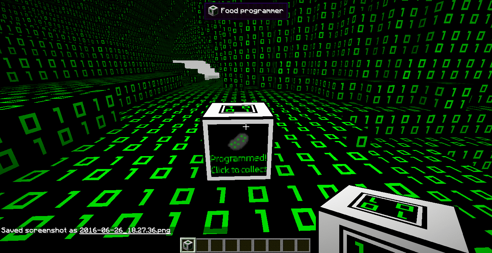

## Hello! 👋

### 

#### I am currently enrolled at [Microverse](https://www.microverse.org/?grsf=knrm9p) as a remote full-stack dev student.

### GitHub stats:

#### This is my current mood while learning code:

<!--
**uwadonat** is a ✨ _special_ ✨ repository because its `README.md` (this file) appears on your GitHub profile.

Here are some ideas to get you started:

- 🔭 I’m currently working on ...
- 🌱 I’m currently learning ...
- 👯 I’m looking to collaborate on ...
- 🤔 I’m looking for help with ...
- 💬 Ask me about ...
- 📫 How to reach me: ...
- 😄 Pronouns: ...
- ⚡ Fun fact: ...

